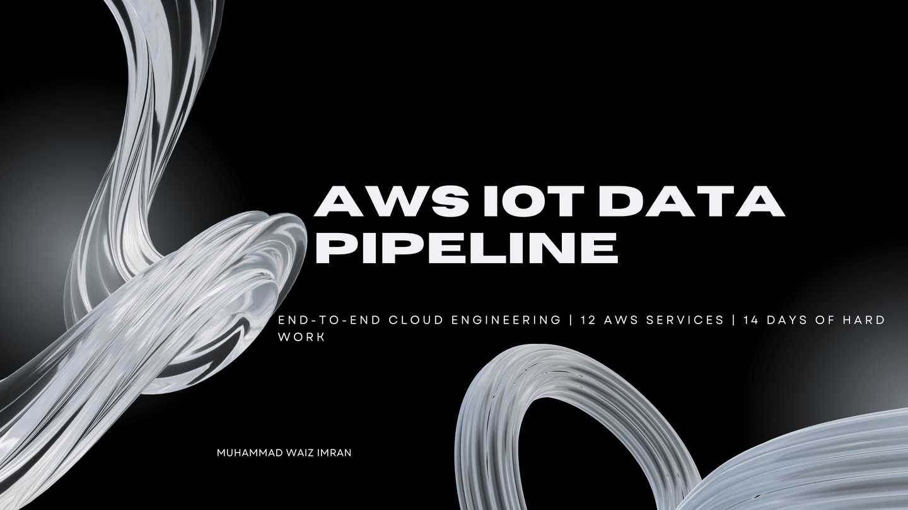

<!-- ╔══════════════════════════════════════════════════════════╗ -->
<!-- ║         SLIDING ANIMATION — 6 Presentation Slides        ║ -->
<!-- ║   Auto-advances every 3.5s · Loops forever · Full width  ║ -->
<!-- ╚══════════════════════════════════════════════════════════╝ -->


<br/>

<div align="center">

<!-- Badges Row 1 -->


<!-- Badges Row 2 -->


<!-- Project Stats Badges -->


</div>

---

> **📖 This is a complete, beginner-friendly, click-by-click guide to building an end-to-end IoT Data Pipeline on AWS from absolute scratch. Every step, every button, every command, every error and its fix is documented here — exactly as it was built over 14 days of hard work.**

---

## 📋 Table of Contents

1. [What This Project Does](#-what-this-project-does)
2. [Architecture Overview](#-architecture-overview)
3. [Full Data Flow](#-full-data-flow)
4. [AWS Services Used](#-aws-services-used)
5. [Phase 1 — IoT Data Ingestion](#-phase-1--iot-data-ingestion)
6. [Phase 2 — On-Premise Database (EC2 MySQL)](#-phase-2--on-premise-database-ec2-mysql)
7. [Phase 3 — Database Migration (AWS DMS)](#-phase-3--database-migration-aws-dms)
8. [Phase 4 — Data Transformation (AWS Glue)](#-phase-4--data-transformation-aws-glue)
9. [Phase 5 — Analytics and Visualization](#-phase-5--analytics-and-visualization)
10. [All Errors and Their Fixes](#-all-errors-and-their-fixes)
11. [Key Configurations Reference](#-key-configurations-reference)
12. [Project Stats](#-project-stats)

---

<div align="center">

## 🎯 What This Project Does

</div>

Imagine a factory with sensors measuring temperature and humidity across the floor. This project builds the complete cloud infrastructure to:

| 🔧 Component | 📋 What it does |
|-------------|----------------|
| 🤖 **Simulate** | 5 virtual IoT sensors generating real data every 5 seconds |
| 📡 **Ingest** | Data through AWS IoT Core (industry-standard message broker) |
| 🗄️ **Store** | In an on-premise MySQL database (simulated using EC2 in a private subnet) |
| 💾 **Back up** | To S3 via Kinesis Firehose (Disaster Recovery strategy) |
| 🔄 **Migrate** | Data to AWS RDS using DMS with Change Data Capture (CDC) |
| 📤 **Export** | Data from RDS to S3 as raw CSV files |
| ✨ **Transform** | Raw data using Apache Spark ETL in AWS Glue |
| 🔍 **Query** | Cleaned data using AWS Athena (serverless SQL) |
| 📊 **Visualize** | Results in Amazon QuickSight dashboards |

**Full lifecycle:** `generation → ingestion → storage → migration → transformation → analytics → visualization`

---

<div align="center">

## 🏗️ Architecture Overview

</div>

```
╔═══════════════════════════════════════════════════════════════════════════╗
║                   On-Premise Data Center (Simulated)                     ║
║                                                                           ║
║   [IoT Sensors] ──► [AWS IoT Core] ──► [IoT Rule] ──► [Lambda Function]  ║
║   (5 virtual)         (MQTT)               │          (MySQL Writer)      ║
║                                            │               │             ║
║                                            ▼               ▼             ║
║                                 [Kinesis Firehose]   [Secrets Manager]   ║
║                                            │          (DB Credentials)   ║
║                                            ▼               │             ║
║                                  [S3 Backup Bucket]         ▼             ║
║                                  (Disaster Recovery)  [EC2 MySQL Server] ║
║                                                        (Private Subnet)  ║
║                                                        [EC2 Bastion Host]║
║                                                        (Public Subnet)   ║
╚════════════════════════════════════════════════╦══════════════════════════╝
                                                 │
                                            [AWS DMS]
                                         (Full Load + CDC)
                                                 │
                                                 ▼
                                          [RDS MySQL]
                                         (Cloud Database)
                                                 │
                                          [DMS Task 2]
                                                 │
                                                 ▼
                                    [S3 Raw Bucket — CSV Format]
                                                 │
                                       [AWS Glue ETL Job]
                                      (Apache Spark Script)
                                                 │
                                                 ▼
                             [S3 Enriched Bucket — Parquet Format]
                                                 │
                                                 ▼
                                          [AWS Athena]
                                      (Serverless SQL Queries)
                                                 │
                                                 ▼
                                      [Amazon QuickSight]
                                       (BI Dashboards) 📊
```

---

<div align="center">

## 🔄 Full Data Flow

</div>

Here is the complete journey of a single sensor reading from creation to dashboard:

```
┌─────────────────────────────────────────────────────────────────────┐
│  Step 1:  IoT Device Simulator generates fake sensor data every 5s  │
│           { "deviceId": "HW4uET7C", "temperature": 27.45, "humidity": 65.20 }
│                                                                     │
│  Step 2:  AWS IoT Core receives the message on MQTT: iot/sensors    │
│                                                                     │
│  Step 3:  IoT Rule fires TWO actions simultaneously:                │
│           ├──► Action 1: Lambda Function → writes to EC2 MySQL      │
│           └──► Action 2: Kinesis Firehose → backs up to S3          │
│                                                                     │
│  Step 4:  Lambda retrieves DB credentials from Secrets Manager      │
│           → Connects to EC2 MySQL (private IP: 10.0.142.166)        │
│           → Inserts row into iotdb.sensor_data table                │
│                                                                     │
│  Step 5:  AWS DMS Task 1 runs continuously:                         │
│           EC2 MySQL → Full Load → RDS MySQL (1,069+ rows migrated)  │
│           CDC then replicates every new INSERT/UPDATE in real-time  │
│                                                                     │
│  Step 6:  AWS DMS Task 2 runs continuously:                         │
│           RDS MySQL → Full Load → S3 Raw Bucket (CSV, no headers)   │
│                                                                     │
│  Step 7:  AWS Glue Apache Spark Job reads the CSV files:            │
│           - Defines manual schema                                    │
│           - Drops null/invalid rows                                  │
│           - Converts to Parquet format (10x faster for queries)     │
│           - Writes to S3 Enriched Bucket                            │
│                                                                     │
│  Step 8:  AWS Athena points to S3 Enriched Bucket:                  │
│           SQL queries run directly on Parquet files                 │
│                                                                     │
│  Step 9:  Amazon QuickSight connects to Athena:                     │
│           → Beautiful BI dashboards with charts and KPIs   📊       │
└─────────────────────────────────────────────────────────────────────┘
```

---

<div align="center">

## ☁️ AWS Services Used

</div>

| # | 🛠️ Service | 📋 What It Does In This Project |
|---|-----------|--------------------------------|
| 1 |  | Receives MQTT messages from sensors on topic `iot/sensors` |
| 2 |  | Deploys IoT Device Simulator — generates 5 virtual sensor devices |
| 3 |  | Serverless Python function that processes IoT data and writes to MySQL |
| 4 |  | Real-time stream that backs up raw IoT data to S3 |
| 5 |  | 3 buckets: backup (DRP), raw (CSV from DMS), enriched (Parquet from Glue) |
| 6 |  | Securely stores MySQL credentials — never hardcode passwords! |
| 7 |  | Two instances: MySQL server (private subnet) + Bastion host (public) |
| 8 |  | Session Manager for secure EC2 access without SSH or public IP |
| 9 |  | Private network with public/private subnets and 5 VPC Endpoints |
| 10 |  | Managed MySQL 8.4 database — the DMS migration target |
| 11 |  | Migrates data from EC2 MySQL to RDS (and RDS to S3) with CDC |
| 12 |  | Apache Spark ETL job transforms raw CSV into enriched Parquet |
| 13 |  | Roles and policies controlling which service can access what |
| 14 |  | Runs serverless SQL directly on S3 Parquet files |
| 15 |  | BI dashboard tool connected to Athena |

---

<div align="center">

# 📡 PHASE 1 — IoT Data Ingestion

[](.)
[](.)

</div>

**Goal:** Get sensor data flowing from virtual devices into a MySQL database and S3 backup.

**What we will build:**

| 🧱 Component | 🎯 Purpose |
|-------------|-----------|
| S3 Backup Bucket | Store raw sensor data backups (Disaster Recovery) |
| IoT Device Simulator | Generate fake sensor data (5 devices, every 5 seconds) |
| Secrets Manager Secret | Store database credentials securely |
| Lambda Function | Receive IoT data and write to MySQL |
| Kinesis Firehose Stream | Real-time backup stream to S3 |
| IoT Rule | Route sensor data to both Lambda and Firehose |

---

## Step 1.1 — Create S3 Backup Bucket

This bucket stores raw sensor data as a disaster recovery backup.

**Click-by-Click:**

1. In the AWS Console search bar, type: `S3` and press Enter
2. Click the orange **"Create bucket"** button
3. Set **Bucket name:** `iot-backup-bucket-waiz-imran`
   - ⚠️ Bucket names must be globally unique — add your own name
4. **AWS Region:** `US East (N. Virginia) us-east-1`
   - Use this same region for ALL services in this project
5. **Block Public Access settings:** Leave all 4 checkboxes **ticked** (default)
   - This is private IoT data — no public access needed
6. Leave everything else as default
7. Click **"Create bucket"** at the bottom

✅ **S3 backup bucket is ready.**

---

## Step 1.2 — Deploy IoT Device Simulator (via CloudFormation)

The IoT Device Simulator is an official AWS solution that creates a web UI for managing virtual IoT devices. We deploy it using CloudFormation — a tool that automatically builds everything from a template.

> 💡 **What is CloudFormation?** Think of it as a blueprint. You give AWS a template file, and it automatically creates all the required services for you — no manual setup needed.

**Click-by-Click:**

1. In the AWS Console search bar, type: `CloudFormation`
2. Click **"Create stack"** → **"With new resources (standard)"**
3. Under **"Specify template"**, select **"Amazon S3 URL"**
4. Paste this URL in the field:
   ```
   https://s3.amazonaws.com/solutions-reference/iot-device-simulator/latest/iot-device-simulator.template
   ```
5. Click **"Next"**
6. Set **Stack name:** `iot-device-simulator`
7. Set **Administrator email:** `your-email@gmail.com`
8. Click **"Next"** → **"Next"** again (leave defaults)
9. On the final page, scroll to the bottom
10. **Tick the IAM acknowledgment checkbox** ✅
11. Click **"Submit"**

> ⏳ Status: `CREATE_IN_PROGRESS` → wait 10-15 minutes → `CREATE_COMPLETE` ✅

**Set Up Virtual Sensors in the Simulator:**

After logging in to the simulator:

1. Click **"Device Types"** → **"Add Device Type"**
2. Fill in:
   - **Device type name:** `IoTSensor`
   - **Topic:** `iot/sensors`
   - **Message frequency:** `5` seconds
3. Add 3 payload attributes:

   | Attribute Name | Type | Min | Max | Precision |
   |----------------|------|-----|-----|-----------|
   | `deviceId` | ID | — | — | — |
   | `temperature` | float | 15 | 40 | 2 |
   | `humidity` | float | 30 | 90 | 2 |

4. Save the device type → click **"Simulations"** → **"Add Simulation"**
5. Set: Device type `IoTSensor`, 5 devices, 5 second interval, 600 second duration
6. Click **"Start"**

**Verify Data is Flowing:**

```json
{
  "deviceId": "HW4uET7CDrHbBEwKfMfBj",
  "temperature": 27.45,
  "humidity": 65.20
}
```

✅ **Sensors are live and publishing data.**

---

## Step 1.3 — Create Secrets Manager Secret

Never hardcode passwords in your code. We store database credentials in AWS Secrets Manager.

**Click-by-Click:**

1. In the AWS Console, search for: `Secrets Manager`
2. Click **"Store a new secret"**
3. **Secret type:** Select **"Other type of secret"**
4. Under **"Key/value pairs"**, add these 5 entries:

   | Key | Value |
   |-----|-------|
   | `username` | `admin` |
   | `password` | `Admin1234!` |
   | `host` | *(leave blank — fill after EC2 is created)* |
   | `port` | `3306` |
   | `dbname` | `iotdb` |

5. Click **"Next"**
6. **Secret name:** `mysql-credentials`
   - ⚠️ **CRITICAL:** The name must be EXACTLY `mysql-credentials`
   - Do NOT write `iot/mysql-credentials` — that naming caused Error #2!
7. Click **"Next"** → **"Next"** → **"Store"**

✅ **Credentials are stored securely.**

---

## Step 1.4 — Create the Lambda Function (MySQL Writer)

This Python function runs every time a sensor message arrives. It reads the JSON payload, connects to MySQL, and inserts the data.

**Click-by-Click:**

1. Search for: `Lambda` → **"Create function"**
2. Select **"Author from scratch"**
3. Set:
   - **Function name:** `iot-mysql-writer`
   - **Runtime:** `Python 3.11`
   - **Architecture:** `x86_64`
4. Click **"Create function"**

**Paste the Code:**

```python
import json
import boto3
import pymysql

def get_secret():
    """Retrieve database credentials from AWS Secrets Manager."""
    client = boto3.client('secretsmanager')
    response = client.get_secret_value(SecretId='mysql-credentials')
    return json.loads(response['SecretString'])

def lambda_handler(event, context):
    """
    Triggered by AWS IoT Rule when sensor data arrives.
    Writes sensor reading to EC2 MySQL database.
    """
    secret = get_secret()
    
    connection = pymysql.connect(
        host=secret['host'],
        user=secret['username'],
        password=secret['password'],
        database=secret['dbname'],
        port=int(secret['port']),
        connect_timeout=5
    )
    
    try:
        device_id   = event.get('deviceId', 'unknown')
        temperature = event.get('temperature', 0)
        humidity    = event.get('humidity', 0)
        
        with connection.cursor() as cursor:
            cursor.execute("""
                CREATE TABLE IF NOT EXISTS sensor_data (
                    id INT AUTO_INCREMENT PRIMARY KEY,
                    device_id VARCHAR(50),
                    temperature FLOAT,
                    humidity FLOAT,
                    recorded_at TIMESTAMP DEFAULT CURRENT_TIMESTAMP
                )
            """)
            cursor.execute(
                "INSERT INTO sensor_data (device_id, temperature, humidity) VALUES (%s, %s, %s)",
                (device_id, temperature, humidity)
            )
        
        connection.commit()
        print(f"Written: device={device_id}, temp={temperature}, humidity={humidity}")
        return {'statusCode': 200, 'body': 'Success'}
    
    finally:
        connection.close()
```

**Add the pymysql Layer:**

```
arn:aws:lambda:us-east-1:336392948345:layer:AWSSDKPandas-Python311:13
```

**Attach IAM Permissions:**
- `AWSLambdaBasicExecutionRole`
- `SecretsManagerReadWrite`
- `AWSLambdaVPCAccessExecutionRole`

✅ **Lambda function is ready.**

---

## Step 1.5 — Create Kinesis Firehose Stream

1. Search for: `Amazon Data Firehose` → **"Create Firehose stream"**
2. Set:
   - **Source:** `Direct PUT`
   - **Destination:** `Amazon S3`
   - **Firehose stream name:** `iot-backup-stream`
3. Select S3 bucket: `iot-backup-bucket-waiz-imran`
4. Click **"Create Firehose stream"**

✅ **Firehose backup stream is ready.**

---

## Step 1.6 — Create the IoT Rule

**Click-by-Click:**

1. Go to **AWS IoT Core** → **"Message routing"** → **"Rules"**
2. Click **"Create rule"**
3. **Rule name:** `IoTToLambdaAndFirehose`
4. **SQL statement:**
   ```sql
   SELECT * FROM 'iot/sensors'
   ```
5. **Add Action 1:** Lambda → `iot-mysql-writer`
6. **Add Action 2:** Kinesis Firehose → `iot-backup-stream`
7. Click **"Create"**

✅ **IoT Rule is active.**

> 🎉 **PHASE 1 COMPLETE!** Sensor data is flowing.

---

<div align="center">

# 🖥️ PHASE 2 — On-Premise Database (EC2 MySQL)

[](.)
[](.)

</div>

**Goal:** Create a private MySQL server on EC2 to simulate an on-premise data center.

> 💡 **Why simulate on-premise?** In real enterprise projects, companies have existing databases on their own servers. This phase simulates that scenario so we can practice migrating data to the cloud using DMS.

| 🧱 Component | 🎯 Purpose |
|-------------|-----------|
| VPC | Private network for our servers |
| Security Group | Firewall rules |
| VPC Endpoints | Secure access to AWS services from private subnet |
| IAM Role | EC2 permissions |
| EC2 MySQL Server | On-premise database simulation (private subnet) |
| EC2 Bastion Host | Emergency access server (public subnet) |
| MySQL Setup | Install and configure MariaDB + binary logging |

---

## Step 2.1 — Create the VPC

> 💡 A VPC (Virtual Private Cloud) is your own private network inside AWS — like a fenced compound where nothing gets in or out unless you allow it.

**Click-by-Click:**

1. Search for: `VPC` → **"Create VPC"**
2. Select **"VPC and more"** (creates subnets automatically)
3. Set:
   - **Name tag:** `iot-pipeline`
   - **IPv4 CIDR block:** `10.0.0.0/16`
   - **Number of Availability Zones:** `2`
   - **Number of public subnets:** `2`
   - **Number of private subnets:** `2`
   - **NAT gateways:** `None` (saves cost — we use VPC Endpoints instead)
   - **VPC endpoints:** `S3 Gateway`
4. Click **"Create VPC"**

**What gets created:**

| Subnet | CIDR | Type | AZ |
|--------|------|------|----|
| `iot-pipeline-subnet-public1` | 10.0.0.0/20 | Public | us-east-1a |
| `iot-pipeline-subnet-public2` | 10.0.16.0/20 | Public | us-east-1b |
| `iot-pipeline-subnet-private1` | 10.0.128.0/20 | Private | us-east-1a |
| `iot-pipeline-subnet-private2` | 10.0.144.0/20 | Private | us-east-1b |

✅ **VPC and subnets created.**

---

## Step 2.2 — Create the Security Group

**Click-by-Click:**

1. VPC Console → **"Security Groups"** → **"Create security group"**
2. Set:
   - **Security group name:** `iot-mysql-sg`
   - **VPC:** `iot-pipeline-vpc`
3. Under **"Inbound rules"**, add:

   | Type | Protocol | Port | Source | Why |
   |------|----------|------|--------|-----|
   | MySQL/Aurora | TCP | 3306 | `10.0.0.0/16` | MySQL access within VPC |
   | HTTPS | TCP | 443 | `10.0.0.0/16` | SSM Session Manager needs this! |

   > ⚠️ **The HTTPS port 443 is CRITICAL!** Without it, SSM Session Manager cannot connect and you'll see "Ping status: Offline". This was **Error #1** in this project.

✅ **Security group created.**

---

## Step 2.3 — Create VPC Endpoints

> 💡 Without VPC Endpoints, a private subnet server is completely isolated. VPC Endpoints open secure tunnels directly to each AWS service.

**Create these 4 Interface Endpoints:**

For each endpoint: VPC Console → **"Endpoints"** → **"Create endpoint"** → select `iot-pipeline-vpc` → both private subnets → `iot-mysql-sg`

| Endpoint Service Name | Why Needed |
|-----------------------|------------|
| `com.amazonaws.us-east-1.ssm` | SSM Session Manager |
| `com.amazonaws.us-east-1.ssmmessages` | SSM Session Manager |
| `com.amazonaws.us-east-1.ec2messages` | SSM Session Manager |
| `com.amazonaws.us-east-1.secretsmanager` | Lambda → Secrets Manager |

> **Note:** S3 Gateway endpoint was already created with the VPC.

✅ **All 5 VPC Endpoints ready.**

---

## Step 2.4 — Create IAM Role for EC2

1. IAM Console → **"Roles"** → **"Create role"**
2. **Trusted entity:** `EC2`
3. Attach policies:
   - `AmazonSSMManagedInstanceCore`
   - `AmazonS3ReadOnlyAccess`
4. **Role name:** `iot-ec2-ssm-role`

✅ **IAM role ready.**

---

## Step 2.5 — Launch EC2 MySQL Server

**Click-by-Click:**

1. EC2 Console → **"Launch instance"**
2. Set:
   - **Name:** `iot-mysql-server`
   - **AMI:** `Amazon Linux 2023 AMI`
   - **Instance type:** `t2.micro`
   - **Key pair:** `Proceed without a key pair` (we use SSM)
3. **Network settings:**
   - **VPC:** `iot-pipeline-vpc`
   - **Subnet:** Private subnet
   - **Auto-assign public IP:** `Disable`
   - **Security group:** `iot-mysql-sg`
4. **IAM instance profile:** `iot-ec2-ssm-role`
5. Click **"Launch instance"**

> 📋 After launch, note the **Private IPv4 address** (e.g. `10.0.142.166`) and update it in Secrets Manager → `mysql-credentials` → `host` field.

✅ **EC2 MySQL server launched.**

---

## Step 2.6 — Launch EC2 Bastion Host

1. EC2 Console → **"Launch instance"**
2. Set: **Name:** `iot-bastion-host`, **AMI:** Amazon Linux 2023, **Instance type:** `t2.micro`
3. Network: **Public subnet**, **Auto-assign public IP:** `Enable`
4. Security group: `iot-mysql-sg`, IAM profile: `iot-ec2-ssm-role`

✅ **Bastion host launched.**

---

## Step 2.7 — Connect to EC2 and Install MariaDB

EC2 Console → Select `iot-mysql-server` → **"Connect"** → **"Session Manager"** tab → **"Connect"**

```bash
# Install MariaDB
sudo dnf install -y mariadb105-server

# Start and enable the service
sudo systemctl start mariadb
sudo systemctl enable mariadb

# Verify it's running
sudo systemctl status mariadb
```

You should see `Active: active (running)` ✅

---

## Step 2.8 — Set Up the Database and User

```sql
-- Connect as root
sudo mysql -u root

-- Create the database
CREATE DATABASE iotdb;

-- Create admin user (accessible from anywhere in VPC)
CREATE USER 'admin'@'%' IDENTIFIED BY 'Admin1234!';

-- Grant permissions
GRANT ALL PRIVILEGES ON iotdb.* TO 'admin'@'%';

-- Grant BINLOG MONITOR — required for AWS DMS CDC!
GRANT BINLOG MONITOR ON *.* TO 'admin'@'%';

FLUSH PRIVILEGES;
EXIT;
```

---

## Step 2.9 — Enable Binary Logging for DMS

```bash
sudo nano /etc/my.cnf.d/mariadb-server.cnf
```

Add to the `[mysqld]` section:

```ini
server-id=1
log-bin=mysql-bin
binlog-format=ROW
binlog_row_image=FULL
expire_logs_days=1
```

```bash
sudo systemctl restart mariadb
```

> ✅ Verify: `SHOW VARIABLES LIKE 'log_bin';` → should show `log_bin | ON`

> 🎉 **PHASE 2 COMPLETE!** Verify with: `SELECT COUNT(*) FROM sensor_data;` — rows should be growing!

---

<div align="center">

# 🔄 PHASE 3 — Database Migration (AWS DMS)

[](.)
[](.)

</div>

**Goal:** Migrate data from EC2 MySQL ("on-premise") to AWS RDS MySQL (cloud), and export a copy to S3.

| 🧱 Component | 🎯 Purpose |
|-------------|-----------|
| RDS MySQL | Cloud-hosted target database |
| DMS Replication Instance | The server that runs migrations |
| DMS Source Endpoint | Points to EC2 MySQL |
| DMS Target Endpoint (RDS) | Points to RDS MySQL |
| DMS Migration Task 1 | Migrates EC2 → RDS with CDC |
| IAM Role for DMS | Allows DMS to write to S3 |
| DMS S3 Target Endpoint | Points to S3 Raw Bucket |
| DMS Migration Task 2 | Exports RDS → S3 CSV |

---

## Step 3.1 — Create RDS MySQL

**Click-by-Click:**

1. Search for: `RDS` → **"Create database"**
2. Set:
   - **Engine:** `MySQL 8.4.3`
   - **Templates:** `Dev/Test`
   - **DB instance identifier:** `iot-rds-mysql`
   - **Master username:** `admin` / **Password:** `Admin1234!`
   - **Instance class:** `db.t3.micro`
   - **Storage:** `20 GiB gp2`
3. **Connectivity:**
   - **VPC:** `iot-pipeline-vpc`
   - **Public access:** `No`
   - **Security group:** `iot-mysql-sg`
4. **Additional config — Initial database name:** `iotdb`
5. Click **"Create database"** → ⏳ Wait ~10 minutes

> 📋 After creation, copy the **Endpoint** address (e.g. `iot-rds-mysql.cy50mmgyo8vs.us-east-1.rds.amazonaws.com`)

✅ **RDS MySQL is ready.**

---

## Step 3.2 — Create DMS Subnet Group

DMS Console → **"Subnet groups"** → **"Create subnet group"**
- **Name:** `iot-dms-subnet-group`
- **VPC:** `iot-pipeline-vpc`
- Add both private subnets

✅ **DMS subnet group ready.**

---

## Step 3.3 — Create DMS Replication Instance

DMS Console → **"Replication instances"** → **"Create replication instance"**

| Setting | Value |
|---------|-------|
| Name | `iot-dms-replication` |
| Instance class | `dms.t3.medium` |
| Engine version | `3.5.4` |
| Allocated storage | `20 GiB` |
| High Availability | `Dev or test workload (Single-AZ)` |
| VPC | `iot-pipeline-vpc` |
| Publicly accessible | `No` |

⏳ Wait ~5 minutes for status: `Available`

✅ **Replication instance ready.**

---

## Step 3.4 — Create DMS Source Endpoint (EC2 MySQL)

DMS Console → **"Endpoints"** → **"Create endpoint"**

| Setting | Value |
|---------|-------|
| Endpoint type | `Source endpoint` |
| Endpoint identifier | `iot-source-mysql` |
| Source engine | `MySQL` |
| Server name | `10.0.142.166` (EC2 private IP) |
| Port | `3306` |
| Username | `admin` |
| Password | `Admin1234!` |
| SSL mode | `none` |
| Database name | **Leave blank!** |
| Extra connection attributes | **Leave EMPTY!** |

> ⚠️ Do NOT add `databaseName=iotdb` in Extra attributes — MySQL does not support this!

Click **"Run test"** → should show ✅ **"Successful"**

✅ **Source endpoint created.**

---

## Step 3.5 — Create DMS Target Endpoint (RDS MySQL)

1. DMS Console → **"Create endpoint"** → **Tick** "Select RDS DB instance"
2. Select `iot-rds-mysql` from dropdown
3. **Endpoint identifier:** `iot-target-rds`
4. Username: `admin` / Password: `Admin1234!`
5. Click **"Run test"** → ✅ Successful

✅ **RDS target endpoint created.**

---

## Step 3.6 — Create DMS Migration Task (EC2 → RDS)

| Setting | Value |
|---------|-------|
| Task identifier | `iot-migration-task` |
| Replication instance | `iot-dms-replication` |
| Source endpoint | `iot-source-mysql` |
| Target endpoint | `iot-target-rds` |
| Migration type | `Migrate existing data and replicate ongoing changes` |
| Target table preparation | `Drop tables on target` |
| Enable CloudWatch logs | ✅ On |
| Schema | `iotdb` / Table: `%` / Action: `Include` |

> ⚠️ **If the task fails** — see Error #5 and Error #6 in the errors section.

**Verify:** Table statistics → `iotdb.sensor_data | Total rows: 1,069` ✅

---

## Step 3.7 — Create IAM Role for DMS S3

IAM → **Roles** → **Create role** → Trusted entity: `DMS` → Attach `AmazonS3FullAccess` → **Role name:** `iot-dms-s3-role`

Copy the **ARN** for later.

---

## Step 3.8 — Create S3 Raw Bucket

S3 Console → **"Create bucket"** → **Bucket name:** `iot-raw-bucket-waiz` → Block Public Access: All ticked ✅

---

## Step 3.9 — Create DMS S3 Target Endpoint

| Setting | Value |
|---------|-------|
| Endpoint type | `Target endpoint` |
| Target engine | `Amazon S3` |
| Endpoint identifier | `iot-s3-raw-target` |
| Service access role ARN | ARN of `iot-dms-s3-role` |
| Bucket name | `iot-raw-bucket-waiz` |

---

## Step 3.10 — Create DMS Migration Task (RDS → S3)

Task identifier: `iot-rds-to-s3-task` → Source: `iot-source-mysql` → Target: `iot-s3-raw-target` → Migration type: `Migrate existing data and replicate ongoing changes`

**Verify:** Go to S3 → `iot-raw-bucket-waiz` → you should see folders with CSV files! ✅

> 🎉 **PHASE 3 COMPLETE!** 1,069 rows migrated successfully.

---

<div align="center">

# ⚙️ PHASE 4 — Data Transformation (AWS Glue)

[](.)
[](.)

</div>

**Goal:** Read raw CSV files from S3, clean the data, and write enriched Parquet files.

| ❌ Issue | ✅ What Glue Fixes |
|---------|------------------|
| CSV files have no headers (col0, col1...) | Manually define schema with real column names |
| Some rows have null values | Drop null rows with `dropna()` |
| CSV format is slow for queries | Convert to Parquet (10x faster, 75% smaller) |
| Data scattered across many files | Consolidate into a clean dataset |

---

## Step 4.1 — Create S3 Enriched Bucket

S3 Console → **"Create bucket"** → **Bucket name:** `iot-enriched-bucket-waiz`

✅ **Enriched bucket ready.**

---

## Step 4.2 — Create IAM Role for Glue

IAM → Roles → Create role → **Trusted entity:** `Glue` → Attach `AWSGlueServiceRole` + `AmazonS3FullAccess` → **Role name:** `iot-glue-role`

---

## Step 4.3 — Create Glue Crawler

Glue Console → **"Crawlers"** → **"Create crawler"**
- **Crawler name:** `iot-raw-crawler`
- **Data source:** `S3` → `s3://iot-raw-bucket-waiz/`
- **IAM role:** `iot-glue-role`
- **Target database:** `iot-glue-db`

Run the crawler → Status: `Ready` → Table `iot_raw_bucket_waiz` appears ✅

---

## Step 4.4 — Create and Run the Glue ETL Job

Glue Console → **"ETL Jobs"** → **"Script editor"** → **"Create script"**

```python
"""
AWS Glue ETL Job — IoT Data Transformation
==========================================
Reads raw CSV IoT sensor data from S3 Raw Bucket.
Applies manual schema (CSV has no headers!).
Drops null rows.
Writes enriched Parquet files to S3 Enriched Bucket.
"""

import sys
from awsglue.utils import getResolvedOptions
from pyspark.context import SparkContext
from awsglue.context import GlueContext
from awsglue.job import Job
from pyspark.sql.types import StructType, StructField, FloatType, StringType, LongType

args = getResolvedOptions(sys.argv, ['JOB_NAME'])
sc = SparkContext()
glueContext = GlueContext(sc)
spark = glueContext.spark_session
job = Job(glueContext)
job.init(args['JOB_NAME'], args)

# === WHY MANUAL SCHEMA? ===
# DMS exports CSV files WITHOUT header rows.
# Spark sees columns as: col0, col1, col2, col3, col4
# We must manually define: col0 = 'id', col1 = 'device_id', etc.

schema = StructType([
    StructField("id",          LongType(),   True),
    StructField("device_id",   StringType(), True),
    StructField("temperature", FloatType(),  True),
    StructField("humidity",    FloatType(),  True),
    StructField("recorded_at", StringType(), True)
])

# === EXTRACT ===
print("Reading CSV files from S3 Raw Bucket...")
df = spark.read \
    .option("header", "false") \
    .option("recursiveFileLookup", "true") \
    .schema(schema) \
    .csv("s3://iot-raw-bucket-waiz/")

raw_count = df.count()
print(f"Raw rows read: {raw_count}")

# === TRANSFORM ===
df_enriched = df.dropna()
enriched_count = df_enriched.count()
print(f"Enriched rows (after cleaning): {enriched_count}")
print(f"Rows removed (nulls): {raw_count - enriched_count}")

# === LOAD ===
print("Writing Parquet files to S3 Enriched Bucket...")
df_enriched.write.mode("overwrite").parquet(
    "s3://iot-enriched-bucket-waiz/enriched-data/"
)

print("Job completed successfully!")
job.commit()
```

**Job Details:**

| Setting | Value |
|---------|-------|
| Name | `iot-glue-etl-job` |
| IAM Role | `iot-glue-role` |
| Type | `Spark` |
| Glue version | `Glue 4.0` |
| Worker type | `G.1X` |
| Number of workers | `2` |
| Temporary directory | `s3://iot-raw-bucket-waiz/temp/` |

Click **"Save"** → **"Run"** → Monitor: `Running` → `Succeeded` ✅

**Verify:** Go to S3 → `iot-enriched-bucket-waiz/enriched-data/` → Parquet files should appear!

> 🎉 **PHASE 4 COMPLETE!**

---

<div align="center">

# 📊 PHASE 5 — Analytics and Visualization

[](.)
[](.)

</div>

**Goal:** Query the enriched data with SQL and build dashboards.

---

## Step 5.1 — Set Up AWS Athena

1. Search for: `Athena` → **"Settings"** → **"Manage"**
2. Set **Query result location:** `s3://iot-enriched-bucket-waiz/athena-results/`
3. Click **"Save"**

---

## Step 5.2 — Create Database and Table

**Create the database:**

```sql
CREATE DATABASE iot_analytics;
```

**Create the external table:**

```sql
CREATE EXTERNAL TABLE iot_analytics.sensor_data (
    id          BIGINT,
    device_id   STRING,
    temperature FLOAT,
    humidity    FLOAT,
    recorded_at STRING
)
STORED AS PARQUET
LOCATION 's3://iot-enriched-bucket-waiz/enriched-data/';
```

---

## Step 5.3 — Run Analytics Queries

```sql
-- Verify data
SELECT * FROM iot_analytics.sensor_data LIMIT 10;

-- Total readings
SELECT COUNT(*) AS total_readings FROM iot_analytics.sensor_data;

-- Average temperature and humidity per device
SELECT
    device_id,
    ROUND(AVG(temperature), 2) AS avg_temp,
    ROUND(AVG(humidity), 2)    AS avg_humidity,
    COUNT(*)                   AS reading_count
FROM iot_analytics.sensor_data
GROUP BY device_id
ORDER BY avg_temp DESC;

-- High temperature alerts (above 35°C)
SELECT device_id, temperature, humidity, recorded_at
FROM iot_analytics.sensor_data
WHERE temperature > 35
ORDER BY temperature DESC;

-- Overall statistics
SELECT
    COUNT(*)                        AS total_readings,
    COUNT(DISTINCT device_id)       AS active_devices,
    ROUND(AVG(temperature), 2)      AS avg_temperature,
    ROUND(AVG(humidity), 2)         AS avg_humidity,
    MIN(temperature)                AS min_temp,
    MAX(temperature)                AS max_temp
FROM iot_analytics.sensor_data;
```

---

## Step 5.4 — Set Up Amazon QuickSight

1. Search: `QuickSight` → **"Sign up for QuickSight"** → **"Standard"** edition
2. **Account name:** `iot-dashboard`
3. Enable access to S3 bucket: `iot-enriched-bucket-waiz`
4. Click **"Finish"**

**Create a Dashboard:**

5. **"New dataset"** → **"Athena"** → Data source name: `iot-athena`
6. Database: `iot_analytics` → Table: `sensor_data`
7. **"Import to SPICE for quicker analytics"** → **"Visualize"**

**Build your charts:**
- 📈 Temperature trend over time
- 💧 Average humidity by device
- 🌡️ High temperature alerts count
- 🗺️ Device activity heatmap

> 🎉 **PHASE 5 COMPLETE! The full pipeline is running end-to-end!** 🎊

---

<div align="center">

# 🐛 All Errors and Their Fixes

[](.)
[](.)

> *"Every error is a lesson in disguise."*

</div>

Every single error encountered during this 14-day build is documented here with the exact fix.

---

## ❌ Error 1 — SSM Session Manager Shows "Offline"

**📍 Where:** Phase 2 — connecting to EC2 MySQL Server

**Symptom:**
```
Ping status: Offline
Session Manager connection status: Not connected
```

**Root Cause:** EC2 is in a private subnet. Without VPC Endpoints, it cannot reach the SSM service. Also, the security group was missing HTTPS (443) inbound rule required by SSM.

**Full Fix:**

1. Create 3 VPC Interface Endpoints:
   - `com.amazonaws.us-east-1.ssm`
   - `com.amazonaws.us-east-1.ssmmessages`
   - `com.amazonaws.us-east-1.ec2messages`
2. Add HTTPS inbound rule to `iot-mysql-sg`: Port 443, Source `10.0.0.0/16`
3. Reboot the EC2 instance (Actions → Instance state → **Reboot**)
4. Wait 2-3 minutes, try Session Manager again

> 💡 **Lesson:** In private subnets, every AWS API call needs a VPC Endpoint. SSM needs 3 endpoints — missing even one causes "Offline" status.

---

## ❌ Error 2 — Lambda Cannot Find the Secret

**📍 Where:** Phase 1 — Lambda function trying to connect to MySQL

**Symptom:**
```
ResourceNotFoundException: Secrets Manager can't find the specified secret.
```

**Root Cause:** The secret was named `iot/mysql-credentials` but the Lambda code was looking for `mysql-credentials`. The slash prefix creates a "path prefix" in Secrets Manager.

**Fix:** Rename the secret to exactly `mysql-credentials` (no path prefix).

> 💡 **Lesson:** Secret names are exact-match strings. A slash creates a path prefix that changes the name.

---

## ❌ Error 3 — Lambda Cannot Connect to MySQL (VPC Issue)

**📍 Where:** Phase 1 — Lambda function after secret was fixed

**Symptom:**
```
Connection timeout. Could not connect to host 10.0.142.166
```

**Root Cause:** Lambda was not configured to run inside the VPC. It was running in AWS's default network, which has no route to the private EC2 MySQL server.

**Fix:**

Lambda Console → Configuration → VPC → **Edit**:
- VPC: `iot-pipeline-vpc`
- Subnets: Both private subnets
- Security group: `iot-mysql-sg`

> 💡 **Lesson:** Lambda functions must be placed inside the same VPC as the resources they need to reach.

---

## ❌ Error 4 — Lambda Cannot Reach Secrets Manager After VPC Config

**📍 Where:** Phase 1 — immediately after fixing Error 3

**Symptom:**
```
Connection timeout when calling Secrets Manager API
```

**Root Cause:** Once Lambda was inside the VPC (private subnet), it lost access to the public Secrets Manager endpoint. Private subnets have no internet gateway.

**Fix:** Create a VPC Interface Endpoint for Secrets Manager:
- Service: `com.amazonaws.us-east-1.secretsmanager`
- VPC: `iot-pipeline-vpc`
- Subnets: Both private subnets
- Security group: `iot-mysql-sg`

> 💡 **Lesson:** VPC Endpoints are needed for EVERY AWS service that a private-subnet Lambda needs to call.

---

## ❌ Error 5 — DMS Task Fails: Binary Logging Not Enabled

**📍 Where:** Phase 3 — first DMS migration task

**Symptom:**
```
Failed in resolving configuration: binary logging is not enabled
```

**Root Cause:** AWS DMS CDC requires MariaDB binary logging to be enabled with ROW format. The default MariaDB installation has binary logging turned off.

**Fix:**

Add to `/etc/my.cnf.d/mariadb-server.cnf`:
```ini
server-id=1
log-bin=mysql-bin
binlog-format=ROW
binlog_row_image=FULL
expire_logs_days=1
```

Then: `sudo systemctl restart mariadb`

> 💡 **Lesson:** Always enable binary logging BEFORE creating DMS tasks. Test endpoints after enabling it.

---

## ❌ Error 6 — DMS Task Fails: BINLOG MONITOR Permission Missing

**📍 Where:** Phase 3 — after fixing Error 5

**Symptom:**
```
Access denied; you need (at least one of) the BINLOG MONITOR privilege(s)
```

**Root Cause:** AWS DMS CDC requires the `BINLOG MONITOR` privilege to read binary logs. This is a MariaDB-specific privilege not present in standard MySQL.

**Fix:**

```sql
GRANT BINLOG MONITOR ON *.* TO 'admin'@'%';
FLUSH PRIVILEGES;
```

> 💡 **Lesson:** MariaDB requires `BINLOG MONITOR` specifically (not just `REPLICATION CLIENT`). Always check which database engine you're running.

---

## ❌ Error 7 — Glue Job Fails: Column Does Not Exist

**📍 Where:** Phase 4 — first Glue ETL job run

**Symptom:**
```
AnalysisException: Column 'id' does not exist.
Did you mean one of the following? [col0, col1, col2, col3, col4, ...]
```

**Root Cause:** CSV files exported by DMS have NO header row. When Spark reads CSV without headers, it names columns `col0`, `col1`, etc.

**What the CSV looked like:**
```
1,HW4uET7CDrHbBEwKfMfBj,2.40E+01,4.60E+01,5/31/2026 16:56
2,33vdZQtv9XYSKHQNWPgFg,3.60E+01,8.40E+01,5/31/2026 16:56
```

**Fix:** Define the schema manually and set `header=false`:

```python
schema = StructType([
    StructField("id",          LongType(),   True),
    StructField("device_id",   StringType(), True),
    StructField("temperature", FloatType(),  True),
    StructField("humidity",    FloatType(),  True),
    StructField("recorded_at", StringType(), True)
])

df = spark.read \
    .option("header", "false") \
    .option("recursiveFileLookup", "true") \
    .schema(schema) \
    .csv("s3://iot-raw-bucket-waiz/")
```

> 💡 **Lesson:** DMS exports raw data without headers. Always define schema manually when reading DMS-exported CSVs in Glue.

---

## ❌ Error 8 — Glue Job Fails: Cannot Create Path from Empty String

**📍 Where:** Phase 4 — second Glue ETL run (after Error 7 was fixed)

**Symptom:**
```
IllegalArgumentException: Can not create a Path from an empty string
```

**Root Cause:** Writing directly to the bucket root without a folder path caused this issue.

**Fix:**

```python
# ❌ WRONG - causes empty path error:
df_enriched.write.mode("overwrite").parquet("s3://iot-enriched-bucket-waiz/")

# ✅ CORRECT - include folder name:
df_enriched.write.mode("overwrite").parquet("s3://iot-enriched-bucket-waiz/enriched-data/")
```

Also set **Temporary directory** in Job Details: `s3://iot-raw-bucket-waiz/temp/`

> 💡 **Lesson:** Always write Glue output to a specific folder path, not directly to the bucket root.

---

## 💡 General Troubleshooting Tips

These are the key lessons from all 8 errors:

| # | 💡 Tip |
|---|--------|
| 1 | **Always check CloudWatch Logs first** — Every AWS service writes detailed errors to CloudWatch. Start here. |
| 2 | **VPC Endpoints solve most "can't reach service" errors** — Private subnet? Add a VPC Endpoint for that service. |
| 3 | **IAM permissions cause ~40% of all errors** — See "denied" or "not allowed"? Add the missing IAM policy. |
| 4 | **Exact names matter** — Secret names, bucket names, and DB names are case-sensitive. Copy-paste, never type manually. |
| 5 | **After config file changes, restart the service** — Changes to `mariadb-server.cnf` need a MariaDB restart. |
| 6 | **DMS "resume" vs "restart"** — Resume = continue from where it stopped ✅. Restart = start from scratch ❌. |
| 7 | **Glue schema errors** — "Column X does not exist"? CSV likely has no headers. Define schema manually. |
| 8 | **Test each endpoint before DMS tasks** — Use "Run test" on endpoints before creating migration tasks. |

---

<div align="center">

# 🔑 Key Configurations Reference

</div>

## VPC Endpoints Required

| Endpoint Service | Type | Required For |
|-----------------|------|--------------|
| `com.amazonaws.us-east-1.ssm` | Interface | SSM Session Manager |
| `com.amazonaws.us-east-1.ssmmessages` | Interface | SSM Session Manager |
| `com.amazonaws.us-east-1.ec2messages` | Interface | SSM Session Manager |
| `com.amazonaws.us-east-1.secretsmanager` | Interface | Lambda → Secrets Manager |
| `com.amazonaws.us-east-1.s3` | Gateway | EC2/Lambda → S3 |

## IAM Roles Summary

| Role Name | Used By | Policies |
|-----------|---------|----------|
| `iot-ec2-ssm-role` | EC2 instances | AmazonSSMManagedInstanceCore, AmazonS3ReadOnlyAccess |
| Lambda execution role | Lambda | AWSLambdaBasicExecutionRole, SecretsManagerReadWrite, AWSLambdaVPCAccessExecutionRole |
| `iot-glue-role` | AWS Glue | AWSGlueServiceRole, AmazonS3FullAccess |
| `iot-dms-s3-role` | AWS DMS | AmazonS3FullAccess |

## S3 Buckets

| Bucket | Format | Source | Used By |
|--------|--------|--------|---------|
| `iot-backup-bucket-waiz-imran` | Raw JSON | Kinesis Firehose | Disaster Recovery |
| `iot-raw-bucket-waiz` | CSV (no headers) | AWS DMS | Glue ETL Input |
| `iot-enriched-bucket-waiz` | Parquet | AWS Glue | Athena, QuickSight |

## MariaDB Binary Logging Config

File: `/etc/my.cnf.d/mariadb-server.cnf`

```ini
[mysqld]
server-id=1
log-bin=mysql-bin
binlog-format=ROW
binlog_row_image=FULL
expire_logs_days=1
```

> ⚠️ Required for AWS DMS CDC. Without this, DMS task fails immediately.

---

<div align="center">

# 📈 Project Stats

</div>

<div align="center">

| 🏆 Metric | 📊 Value |
|-----------|---------|
| ⏱️ Total build time | **14 days** |
| ☁️ AWS Services used | **12+** |
| 🤖 Virtual IoT sensors | **5** |
| 📡 Sensor frequency | **Every 5 seconds** |
| 📊 Rows migrated via DMS | **1,069+** |
| 🐛 Errors encountered | **8 major, 100+ total** |
| 📁 S3 buckets created | **3** |
| 🔐 VPC Endpoints | **5** |
| 🏗️ CloudFormation stacks | **3** |
| 🧱 VPCs created | **1** |
| 🔒 IAM roles created | **4** |
| ❌ Times I wanted to quit | **Too many** |
| 💪 Times I actually quit | **0** |

</div>

---

<div align="center">

## 👨‍💻 Author

<!-- Profile Banner -->


### **Waiz Imran**

[](https://linkedin.com)
[](https://github.com)

*Built with ❤️ and a lot of ☕ — 14 days of pure AWS learning and debugging.*

---

> *"2 weeks ago I didn't know what a VPC was. Today I built a production-grade IoT data pipeline with 12 AWS services, migrated 1,069 rows of data, debugged 8 major errors, and connected everything from sensors to dashboards."*

> *"Cloud engineering isn't about memorizing services. It's about understanding how they connect — and having the patience to fix them when they don't."*

---


</div>

---

## 📄 License

This project is open source — [MIT License](LICENSE).

---

<div align="center">

⭐ **If this guide helped you build something, give it a star!**

🚀 **Happy Building — and remember, every error is a lesson!**


</div>
